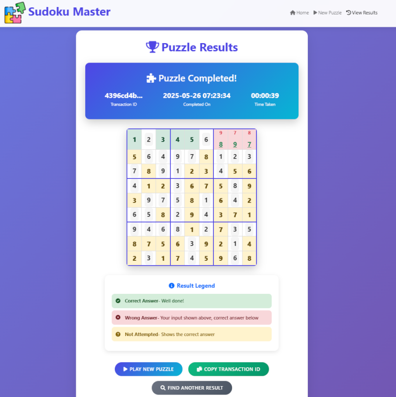

# Sudoku Master

A feature-rich Sudoku game web application built with Django. Challenge yourself with puzzles of varying difficulty levels, track your progress, and improve your logical thinking skills. Check service in action at [Sudoku Master](https://axiosedge.xyz/sudoku/).

## 🎮 Features

### Multiple Difficulty Levels
- **Easy**: `25-35 cells to fill`
- **Medium**: `35-45 cells to fill`
- **Hard**: `45-55 cells to fill`
- **Extra Hard**: `55-60 cells to fill`

### Interactive Gameplay
- Real-time timer to track your solving speed
- Input validation with immediate feedback
- Duplicate detection for easier puzzle solving
- "Guess mode" - Right-click to mark uncertain entries

### Progress Tracking
- Unique transaction ID for each puzzle
- Detailed results with correct/incorrect/missing answers
- View completion time and accuracy
- Search and retrieve previous puzzle attempts

### User Experience
- Modern, responsive design
- Mobile-friendly interface
- Clear visual feedback
- Optimized performance

## 🖥️ Screenshots


## 🚀 Getting Started

### Prerequisites
- Python 3.11+
- Django 5.2+

### Installation

1. Clone the repository:
   ```bash
   git clone https://github.com/amithpdn/sudoku-master.git
   cd sudoku-master
   ```

2. Create a virtual environment (optional but recommended):
   ```bash
   python -m venv .venv
   source .venv/bin/activate  # On Windows use `.venv\Scripts\activate`
   ```

3. Install dependencies:
   ```bash
   pip install -r requirements.txt
   ```

4. Apply migrations:
   ```bash
   python manage.py migrate
   ```

5. Start the development server:
   ```bash
   python manage.py runserver
   ```

6. Visit `http://127.0.0.1:8000/sudoku/` in your browser to start playing!

## 🏗️ Project Structure

```
sudoku_master
|   .gitignore
|   LICENSE.md
|   manage.py
|   README.md
|   requirement.txt
|
|
+---sudoku
|   |   admin.py
|   |   apps.py
|   |   error_utils.py
|   |   middleware.py
|   |   models.py
|   |   script_name_middleware.py
|   |   tests.py
|   |   urls.py
|   |   utils.py
|   |   views.py
|   |   __init__.py
|   |
|   +---logs
|   |
|   +---migrations
|   |
|   +---static
|   |   \---sudoku
|   |       |
|   |       \---images
|   |               logo.png
|   |
|   +---templates
|   |   \---sudoku
|   |           error.html
|   |           index.html
|   |           new_puzzle.html
|   |           view_puzzle.html
|   |
|   +---templatetags
|           custom_filters.py
|        
|
\---sudoku_game
        asgi.py
        settings.py
        urls.py
        wsgi.py
```

## 🧠 How to Play

1. Select a difficulty level
2. Fill in the empty cells with numbers 1-9
3. Each row, column, and 3×3 box must contain digits 1-9 exactly once
4. Use right-click to mark guesses with a "?" prefix
5. Submit your solution when ready
6. Review your results and share your transaction ID to compete with friends!

## 🔧 Technical Features

- Backend puzzle generation algorithm
- Session-based game state management
- Transaction tracking
- Performance monitoring
- Detailed logging

## 🛠️ Technologies Used

- **Backend**: Django, Python
- **Frontend**: HTML5, CSS3, JavaScript, Bootstrap 5
- **Database**: SQLite (development), MySQL (production recommended)

## 👥 Contributing

Contributions are welcome! Please feel free to submit a Pull Request.

## 📝 License

This project is licensed under the MIT License - see the [LICENSE](LICENSE.md) file for details.

## More Screenshots





## 📞 Contact

Amith Lokugamage - [GitHub](https://github.com/amithpdn) [hello.appkiddo@gmail.com](mailto:hello.appkiddo+bugs@gmail.com)
